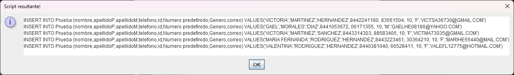

# Generador de nombres
Este proyecto tiene la finalidad de crear datos para bases de datos.
 
Este proyecto funcionara con una lista de texto que tenga ciertos datos y numeros random
que se crearan a partir de codigo. 
ESTE PROYECTO UTILIZA JDK 20 ASEGURATE DETENERLO DESCARGADO
[JDK](https://www.oracle.com/mx/java/technologies/downloads/#jdk20-windows)

## DATOS QUE GENERA DE MOMENTO
- Nombre
- Apellido Paterno
- Apellido Materno
- Telefono
- Numeros random (puede usarse como un id)
- Correo
- Genero
- Numero predefinido (Si quieres que todos los registros que generes tengan algun numero como un foreign key)

## Que archivos hay?
El archivo cuenta solamente con 2 archivos de texto, uno para los [nombres](https://github.com/NexWan/Generador-de-datos/blob/master/src/main/resources/com/nexwan/generadornombres/nombres.txt) y otro
para los [apellidos](https://github.com/NexWan/Generador-de-datos/blob/master/src/main/resources/com/nexwan/generadornombres/apellidos.txt). 
Cabe mencionar que estos estan basados en los mas comunes de Mexico. 
Los datos como telefono y numero random son generados mediante codigo. 
El dato de correo es generado mediante un substring del nombre, apellido y numeros random, agregandole un @ declarado en el codigo.

## Screenshots
### Interfaz Principal con sus opciones

### Se pregunta cuantos datos quiere generar

### Configuracion de la tabla
Aqui en esta parte se tiene que espeficificar tomando en cuenta el nombre del atributo en tu tabla de Oracle! 

### Script resultante
Te da un script con la insercion de los datos que pediste ya formateado con su nombre de tabla y de los atributos 

TO DO:
- Agregar la opcion de poder agregar datos customizable.
    Es decir, no depender solamente de los registros que tengo yo.
- Mejorar la interfaz
- Hacer uso de alguna api para obtener datos y no depender de un archivo local.
- Optimizar el codigo
